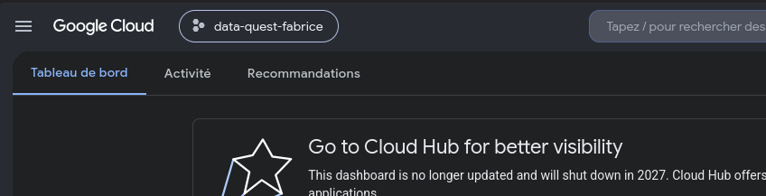
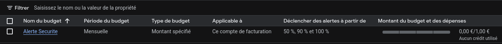
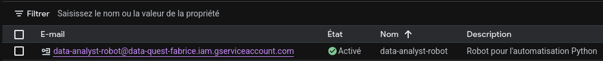
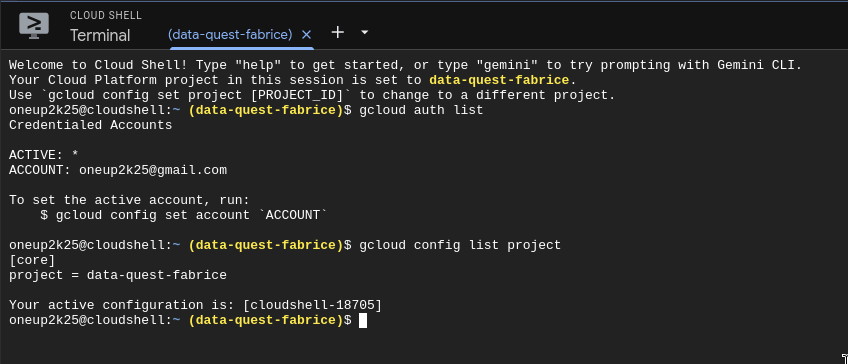

# Quête GCP 1.3 — Configuration d'un environnement Cloud

Documentation de la configuration d'un environnement de travail sur **Google Cloud Platform (GCP)**, dans le cadre d'une quête de la Wild Code School.

L'objectif est de mettre en place un projet cloud sécurisé et prêt pour des travaux d'analyse de données / automatisation Python :

- Création d'un projet GCP dédié
- Mise en place d'un garde-fou financier (alerte de budget)
- Création d'un compte de service pour l'automatisation
- Vérification de l'accès en ligne de commande via Cloud Shell

---

## 1. Création du projet GCP

Création du projet **`data-quest-fabrice`** depuis la console Google Cloud. Le tableau de bord (« Tableau de bord ») confirme que le projet est actif et sélectionné.



---

## 2. Alerte de budget (facturation)

Mise en place d'une **alerte de budget** nommée `Alerte Securite` pour éviter toute dépense imprévue :

| Paramètre | Valeur |
|-----------|--------|
| Nom du budget | `Alerte Securite` |
| Période | Mensuelle |
| Type de budget | Montant spécifié |
| Applicable à | Ce compte de facturation |
| Seuils d'alerte | 50 %, 90 % et 100 % |
| Montant | 1,00 € |

Des notifications sont déclenchées dès que les dépenses atteignent 50 %, 90 % puis 100 % du plafond fixé.



---

## 3. Compte de service (Service Account)

Création d'un **compte de service** dédié à l'automatisation Python, sans utiliser le compte utilisateur principal :

| Paramètre | Valeur |
|-----------|--------|
| E-mail | `data-analyst-robot@data-quest-fabrice.iam.gserviceaccount.com` |
| Nom | `data-analyst-robot` |
| État | Activé |
| Description | Robot pour l'automatisation Python |



---

## 4. Vérification via Cloud Shell

Vérification de la configuration directement depuis **Cloud Shell** avec la CLI `gcloud` :

```bash
# Lister les comptes authentifiés
gcloud auth list

# Vérifier le projet actif
gcloud config list project
```

Les sorties confirment que le compte `oneup2k25@gmail.com` est actif et que le projet courant est bien `data-quest-fabrice`.



---

## Récapitulatif

| Étape | Élément configuré | Statut |
|-------|-------------------|--------|
| 1 | Projet GCP `data-quest-fabrice` | ✅ Actif |
| 2 | Alerte de budget mensuelle (50/90/100 %) | ✅ Configurée |
| 3 | Compte de service `data-analyst-robot` | ✅ Activé |
| 4 | Vérification CLI via Cloud Shell | ✅ Validée |

L'environnement Google Cloud est configuré, sécurisé (budget + compte de service dédié) et opérationnel.
