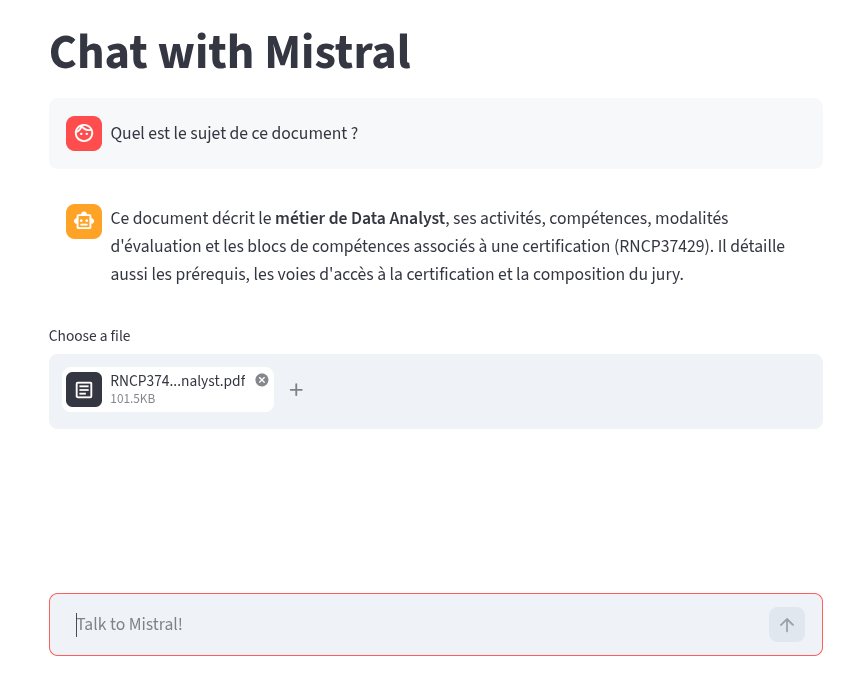

# Chat with PDF — Assistant documentaire (Mistral + Streamlit)

Application de question-réponse sur documents PDF reposant sur une architecture
RAG (*Retrieval-Augmented Generation*). L'utilisateur charge un ou plusieurs PDF,
pose une question en langage naturel, et le système répond en s'appuyant sur les
passages pertinents extraits des documents.



*Figure 1 — Interface : barre de saisie, fil de conversation et sélecteur de fichier PDF.*

## 1. Principe

Le modèle de langage ne reçoit pas le document entier mais uniquement les
fragments les plus proches de la question, sélectionnés par similarité
sémantique. Cette approche réduit le coût, contourne la limite de contexte du
modèle et ancre la réponse dans le contenu fourni.

Pipeline :

1. **Extraction** — le texte est extrait des PDF (PyPDF2).
2. **Découpage** — le texte est segmenté en fragments de 4096 caractères.
3. **Vectorisation** — chaque fragment et la question sont convertis en vecteurs
   d'embedding (`mistral-embed`).
4. **Recherche** — un index FAISS (distance L2) retourne les 4 fragments les plus
   proches de la question.
5. **Génération** — les fragments retenus sont fournis comme contexte au modèle
   de chat (`mistral-small-2603`), encadré par un *system prompt* qui contraint la
   réponse au document.

## 2. Dépendances

| Bibliothèque | Rôle |
|--------------|------|
| `streamlit` (1.57.0) | Interface web et gestion d'état |
| `mistralai` (2.4.8)  | Client API (chat et embeddings) |
| `numpy` (2.4.4)      | Manipulation des vecteurs |
| `PyPDF2` (3.0.1)     | Extraction de texte PDF |
| `faiss-cpu` (1.14.2) | Index de recherche vectorielle |

## 3. Installation

```shell
pip install streamlit mistralai numpy PyPDF2 faiss-cpu
```

## 4. Configuration

La clé API Mistral est lue depuis l'environnement ; elle n'est jamais écrite dans
le code.

```shell
export MISTRAL_API_KEY="votre_cle"
```

En l'absence de cette variable, l'application affiche une erreur et s'interrompt.

## 5. Exécution

```shell
streamlit run main.py
```

L'application s'ouvre dans le navigateur. Charger un PDF via le sélecteur de
fichier, puis poser une question dans la barre de saisie. La réponse est affichée
en flux (*streaming*).

## 6. Détails d'implémentation

- **État de session** — Streamlit ré-exécute le script à chaque interaction.
  L'historique des messages et les PDF chargés sont conservés dans
  `st.session_state` pour persister entre les exécutions.
- **Grounding** — un `SYSTEM_PROMPT` impose au modèle de répondre uniquement à
  partir du contexte fourni, de signaler les informations absentes du document et
  de rester concis.
- **Isolation de l'historique** — le contexte RAG est injecté dans une copie
  locale des messages, sans modifier l'historique stocké en session.

## 7. Limites connues

- Les embeddings sont recalculés à chaque question : tous les fragments sont
  ré-encodés via l'API et l'index FAISS est reconstruit à chaque appel. Un cache
  réduirait la latence et le coût.
- La segmentation par nombre de caractères ne respecte pas les frontières
  sémantiques (phrases, paragraphes).
- Le nombre de fragments récupérés (`k = 4`) est fixe et indépendant de la taille
  des documents.

## 8. Structure

```
chatbot/
├── main.py      # Application Streamlit (extraction, RAG, chat)
├── docs/        # Documents PDF de test
└── README.md
```

## 9. Source

Projet dérivé du cookbook officiel Mistral. Le code original cible le SDK
`mistralai` 0.4 ; il a été adapté ici au SDK 2.4.8 (API `client.chat.stream`,
`client.embeddings.create`).

- https://docs.mistral.ai/resources/cookbooks/third_party-streamlit-readme
